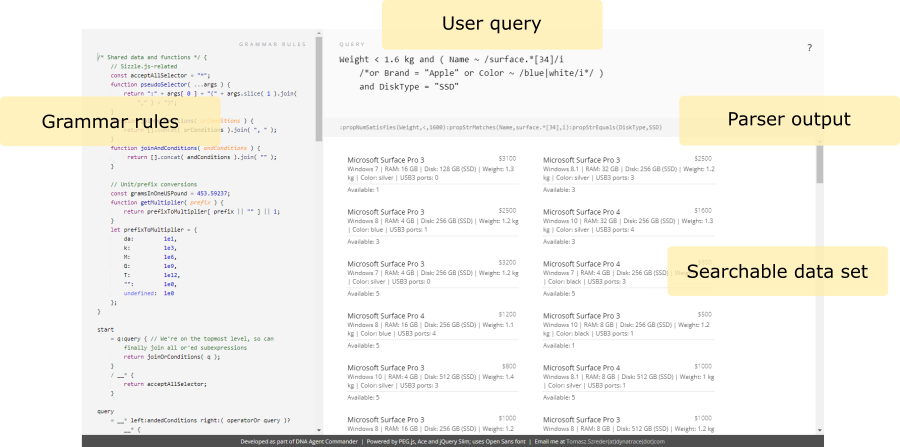

### Testing language grammar and queries: CQL Playground

Throughout the article we will craft grammar rules and test queries using a simple serverless application: the CQL Playground (named after "Customizable Query Language", in no way related to the [other CQLs](https://en.wikipedia.org/wiki/CQL)).

It depends on PEG.js, Ace, and jQuery Slim hosted via CDN, but is otherwise a single-file, self-contained web page, so there is no setup needed – just open the file in a modern browser and you're ready. (Grammar and query editors use localStorage to remember their contents, but be sure to save your work outside of the application.)

Usage is straightforward: the grammar editor to the left lets you refine parser, which effectively determines what the query language is capable of. Your grammar is immediately compiled to a parser on every change; in case of problems, an error message is displayed at the bottom along with the error context (line, column).

The query editor (in the top-right corner) is the actual user input fed to the parser. If it does not comply with the rules defined in the grammar to the left, an error message pane shows up with the details; otherwise it is used to produce parser output, displayed just below the editor. (Typically, this would be a Sizzle.js pseudo-selector expression, but you can ignore the filtering part if you just want to debug the grammar or test various options.)

The bottom-right area of CQL Playground is where our element set is displayed, with the filter applied. This is how you can test the effect your query has on a data set. Sample data is generated quasi-randomly on each page refresh and it populates the application with about 1000 notebook items. (You can modify sample data generators to your liking in the page code – look for NotebookCreator and Notebook modules, and remember to update their cached references in the QueryEditor instance: setSearchableElements(), triggerChanged().)

Even though our test page uses jQuery Slim (which includes Sizzle.js as a component), it's the selector engine we need, so be sure to include the minimal required dependency to avoid code bloat in your own projects (Sizzle.js alone weighs only 4 KB, compared to about 24 KB of the slim jQuery distribution).

(Note: CQL Playground makes use of several ES6 and CSS3 features; they are supported by the recent revisions of popular browsers, but if you think something looks plain wrong or doesn't work at all, make sure you're using the latest available version of your browser, or consider running the script sources through a modern transpiler such as Babel, Traceur, or Typescript for better compatibility.)
